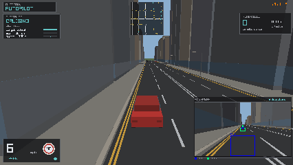
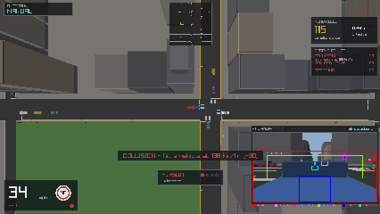
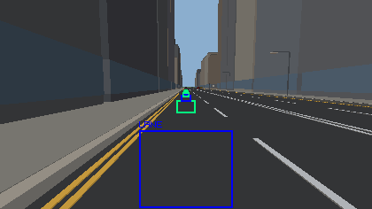
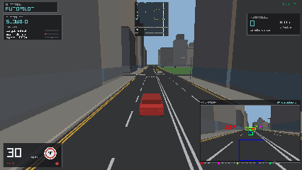
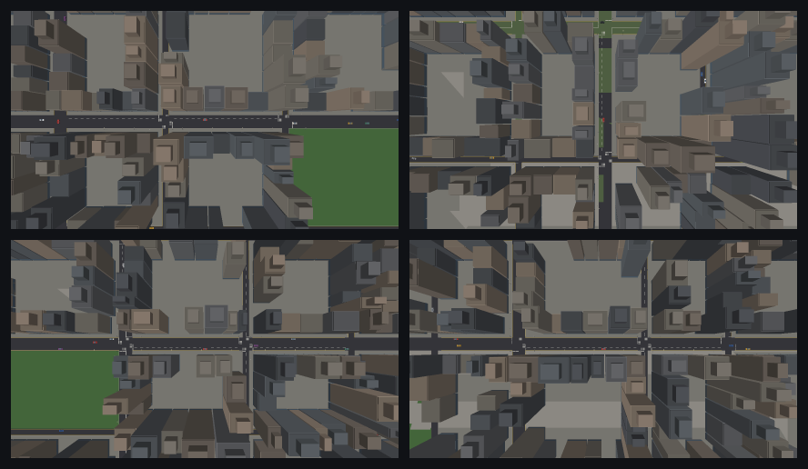

# autobahn

*n.* a road built for driving on. Also: a British city that only exists to be driven through.

A 3D driving game in Go. Part one is you, a car, and a procedurally generated
British city with traffic, lights, signs, road rules and police. Part two hands
the same car to an autopilot that sees the world **only through a camera**, as
colour-coded detection boxes it has to read back out of the pixels.

Both drivers are scored by the same judge, so the comparison is honest.




*The autopilot at the wheel. The panel in the corner is the image it is reading.*

## Running it

```sh
just run              # drive it yourself
just drive            # hand the car to the autopilot
just ci               # lint + test + build + the boundary check
```

Or without `just`:

```sh
go run -tags x11 ./cmd/autobahn            # the x11 tag is Linux-only
go run -tags x11 ./cmd/autobahn -autopilot
```

raylib needs a windowing backend. On Linux, `-tags x11` builds against X11
alone, which avoids needing the Wayland development headers; on macOS and
Windows no tag is required. The `justfile` picks the right one for you.

Everything is generated in code — geometry, layout, materials. There are no
asset files, nothing is downloaded at runtime, and the whole thing runs offline.

## Controls

| Key | |
|---|---|
| `W` / `S` | throttle, brake (and reverse once stopped) |
| `A` `D` | steer |
| `Space` | handbrake — it will break traction and slide |
| `Tab` | **hand the car to the autopilot, and take it back** |
| `C` | chase / bonnet / overhead camera |
| `V` | show or hide the AI camera panel |
| `L` | class labels on the detection boxes |
| `N` | drop back onto the nearest lane |
| `R` | return to the start |
| `P` `H` | pause, help |

`-mute` turns the sound off.

## Part one: driving

The city is a seeded grid with varied block spans, arterials every third line,
and buildings that grow taller toward the middle. Reroll it with `-seed`.

The car is a bicycle model with slip angles, so it has weight transfer, it
understeers when you ask too much of the front, and the handbrake kills rear
grip and rotates it. Traffic runs the Intelligent Driver Model along the lane
graph: it queues, follows, indicates, gives way, and stops at red lights.

It is British, so:

- traffic keeps **left**, and it is the **right** turn that crosses oncoming traffic
- limits are posted in **mph** — 20 on residential streets, 30 built-up, 40 on the main roads
- signals run **red → red and amber → green → amber**, and red-and-amber is *not* permission to go
- **roundabouts**, circulating clockwise, giving way to the right on entry
- **give way** is the common priority marking, with stop signs the rarer case
- centre lines are **white**; the yellow paint is double yellows against the kerb
- zebra crossings, pavements and kerbs, because you will end up on one

### Roundabouts

About a quarter of the junctions are roundabouts. Traffic gives way to whatever
is already circulating and about to reach the entry — the car coming from your
right — and how small a gap a driver will accept comes from their style, so an
aggressive one pulls out into a gap a cautious one would let go.

The ring is built from short straight lanes joined end to end rather than as a
curve. That was a deliberate choice: every system that already understands a
lane — the traffic agents, the navigation route, the judge, the annotator — then
works on a roundabout with no changes whatsoever, and keeping the pieces under
five metres makes the polygon read as a circle.

### What is on the road

Traffic is not one car repainted. Six shapes share the streets, each with its
own dimensions and its own way of driving:

| | |
|---|---|
| hatchback | 34% of traffic, and the reference |
| saloon | 24%, longer and heavier |
| estate | 14%, longer still, with the cabin carried right back |
| van | 14%, tall and boxy, slow to get going and slower to stop |
| taxi | 8%, upright, and always in black |
| hot hatch | 6%, short, light, and quick |

A van needs a third more room to pull up than a hot hatch and corners like it
too, so which shape is in front of you actually matters. Police drive a marked
estate. The car you are given is a hot hatch, on the grounds that it is the one
being chased.

### Driving styles

Ambient traffic is not one driver copied out. Each car draws a `Style` that
supplies every parameter the car-following model uses, so the queue in front of
you is made of individuals:

| Style | Drives like |
|---|---|
| cautious | 18% of traffic. Under the limit, big gaps, lifts early for an amber. |
| normal | 46%. The reference the others vary from. |
| brisk | 26%. Presses on, closes up, still within the rules. |
| aggressive | 10%. Quick, close enough to fill your mirrors, and will chance an amber. |

Speed, headway, standstill gap, acceleration and braking rates, how much room
they want before pulling out of a junction, how hard they slow for a corner, and
whether they run an amber all come from the style. Each car then jitters its own
numbers slightly, so two aggressive drivers are not identical.

The player is not styled — a human drives however they like — and the autopilot
has its own controller.

### The rules it judges you on

A judge watches your car and logs what you break: running a red, failing to stop,
speeding, driving on the wrong side, leaving the carriageway, and collisions
(with severity from the impact speed). Each fault carries penalty points.

The judge does not care whether a human or the autopilot is driving.

### The police



*A pursuit, seen from above. Nothing here is staged — the offences were earned.*

Marked units patrol the city like any other traffic, driving to the limit and
stopping at lights, until something happens.

The judge already publishes every infraction on a crucible telemetry bus for the
HUD, so the police subscribe to the same stream. An offence raises **heat** only
if they actually notice it: a unit has to be close enough to have seen it, or a
pursuit has to be under way already, in which case they are watching by
definition. Speeding down an empty side street is between you and your
conscience.

Heat becomes a **wanted level** from one to four. Units within range switch on
the blues, and from then on they route through the junction graph toward you
rather than wandering their patrol — greedily, picking whichever exit ends up
nearest, which is enough on a grid. On a call they are quicker, they close up,
and they will pass a red, slowing to do it.

Once a driver is wanted at level two, units stop only chasing and start getting
**ahead**. A block of three is parked across the carriageway on the road the
navigation route says you are about to take, angled across it rather than left
neatly in lane. The units furthest from you are pulled for it, so the block is
never built out of the cars currently on your tail, and it is lifted and set
again further on once you are past it.

Getting out of it, in the order the game will let you:

- **Evade.** Stay more than 190 m from every unit for seven and a half seconds
  and you shed a level. The HUD says `EVADING` and counts down.
- **Cool off.** Stop offending and the heat fades on its own, so one mistake
  does not follow you across the city.
- **Pull over.** Stop with a unit alongside and you are `PULLED OVER`: the
  pursuit ends and the level clears.

`-police 0` removes them entirely. The judge still scores everything; there is
simply nobody to respond.

### Exercising it

Driving badly on purpose is tedious, so there is a controller that does it:

```sh
go run -tags x11 ./cmd/autobahn -reckless
```

It follows the road and ignores everything else — limits, signals, signs. It
slows for a corner only because a car wrapped around a building stops exercising
anything. Every fault it collects is judged through the ordinary path, so it is
the end-to-end test of the police: about 200 penalty points in twenty seconds,
and a wanted level of three.

## Part two: the AI drives

Press `Tab`. The car keeps driving; nothing else changes.

Every frame the game renders a second view from a bonnet-mounted camera into an
off-screen texture, and paints colour-coded boxes over everything relevant — one
colour per class, in the style of a security camera running object detection.
That image is then **read back a pixel at a time** and the boxes are recovered by
flood-filling runs of each exact class colour. The result is a list of
detections: a class and a rectangle. That is all the autopilot ever receives.

The panel in the corner is not a visualisation of the AI's state. It is the
actual image being scanned. What you see is what it gets.



*The feed on its own: boxes tracking traffic, signals and the lane ahead.*

### The classes

| | | | |
|---|---|---|---|
| 🟥 vehicle | 💗 police | 🟪 light: red | 🌸 light: red+amber |
| 🟧 light: amber | 🟩 light: green | 🟨 stop | 🩵 give way |
| 🟦 lane | 🟢 lane (alt) | 🔵 limit 20 | 🩵 limit 30 |
| 🟣 limit 40 | 🟩 stop line | | |

Every class colour is a fully saturated combination of 0, 128 and 255. Nothing
in the world's palette uses one, so an exact pixel match cannot produce a false
positive — a fact the tests check.

Consecutive lane markers **alternate** between two colours. Once they are far
enough away to be a few pixels across their boxes touch, and two runs of one
colour would flood-fill into a single meaningless blob.

### What the autopilot actually knows

Being precise about this, because it is the whole point:

- **From pixels**: every vehicle, signal, sign, stop line and lane marker, as a
  class and a screen rectangle. Range comes from where a box's bottom edge
  falls, intersected with the road plane — or, for a signal, with its known
  mounting height. Bearing comes from the column.
- **From odometry**: its own road speed. Every real car has this.
- **From navigation**: which way to turn at the next junction. That is a satnav
  decision, not a perception one. It reaches the autopilot *through the camera*
  as the lane markers it must still visually track.
- **Nothing else.** It cannot read the simulation.

That last claim is enforced by the compiler, not by good intentions. Package
`autopilot` imports `vision` and nothing else from this project, and `vision` is
pure — it depends only on the standard library and `mathx`. The annotator, which
does know about the world, lives in a separate package that the autopilot cannot
reach:

```sh
just boundary
# github.com/danielriddell21/autobahn/internal/mathx
# github.com/danielriddell21/autobahn/internal/vision
# github.com/danielriddell21/autobahn/internal/autopilot
# OK: autopilot sees only vision and mathx
```

### How it drives

Pure pursuit on the lane markers for steering; a target-speed governor feeding
throttle and brake for everything else. It obeys the tightest constraint among
the speed limit it last read, the curvature ahead, the car in front, and any
junction it can see.

Three behaviours exist because the naive version got caught out, and each is a
fix for a failure that actually happened during testing:

- **Signals are ranged directly** off their mounting height, because the stop
  line painted at their feet is routinely hidden by the car waiting on it.
- **A stop line is dead-reckoned** on odometry once it leaves view, so it
  survives occlusion and the final metres where it drops below the lens.
- **Junctions are approached at a speed the car can stop from** unless green is
  actually confirmed. Without this it would arrive at a green light too fast to
  stop when it changed — the dilemma zone — and run the red.

Amber means stop unless stopping would be unsafe, which is the rule as written.



*Slowing for a red it detected, and holding at the line.*

### Scoring it

The autopilot is graded across a spread of cities, with **no display involved
at all**:

```sh
just eval                          # 12 cities, 90 simulated seconds each
just eval -seeds 40 -workers 8
```

```
seed  distance  avg mph  det/frame  no lane  points  faults
1     359 m     9        11.3       0%       0       0
2     376 m     9        8.7        18%      50      3
...
12 cities, 83% clean (10 of 12)
mean 359 m at 9 mph, 13.3 penalty points, 0.58 faults
lane lost on 4.1% of frames
```

Twelve cities take about five seconds, and CI fails the build if the mean
penalty climbs.

Nothing is short-circuited to achieve that. The annotator projects the world
into boxes, the boxes are rasterised into an image, and the scanner reads that
image back a pixel at a time — the autopilot still receives only pixels. It
works without a GPU because **the scanner matches exact class colours and never
looks at the scene behind the boxes**, so rasterising the boxes alone produces
exactly the detections a rendered frame would. `Layout` is shared by both paths,
so the two cannot drift apart.

That harness immediately corrected the record. Running a handful of seeds by
hand had suggested the autopilot was faultless; across twelve it is clean on
ten. It also pinned the dominant failure — losing sight of the lane — and one
fix for it, described under known limitations below.

### Seeing a single run

```sh
just soak 1800     # drive headlessly, then print a summary
```

```
--- autopilot session ---
  drove      342 m in 36 s (avg 21 mph over 2000 frames)
  perception 30.3 detections/frame, saw lane markers to 72 m
  penalty    0 points from 0 faults
```

`-record drive.gif` captures the drive. `-debugvision` prints the camera's range
estimates against the simulation's ground truth, which is how the camera model
was validated: **15.0 m estimated against 16.2 m actual**, from pixels alone.

## Built on crucible

This game is a raylib app, so the Ebiten-facing half of
[crucible](https://github.com/danielriddell21/crucible) (`window`, `menu`,
`camera`) does not apply. Everything display-free does, and is used:

| Package | Used for |
|---|---|
| `rng` | Every random draw. Layout, traffic, signal offsets and routing each take a named stream, so adding one system never disturbs another's sequence. |
| `ring` | The infraction history, bounded so a long session cannot grow it without end. |
| `telemetry` | The judge publishes each infraction on a bus, generic over this game's own event type. Both the HUD and the police subscribe to it, which is how an offence becomes a pursuit without the two knowing about each other. |
| `hud` + `status` | Those events become the on-screen fault toast, wired judge → bus → status source → overlay. |
| `keymap` | The controls panel, wrapped to the available width. |
| `paint` | Colour dimming for façades, roofs and brake lights. |
| `synth` | Every sound in the game: engine, siren, tyres and impacts, synthesised at startup with no audio files, and `synth.WAV` to hand them to raylib. |
| `hub` | Not used. It coordinates leader and child *windows* on one machine; this game needed two machines, so it has its own small netplay package instead. |
| `record` | `-record drive.gif` in the game, and every file `demogen` writes. Its `Add(image.Image)` is renderer-agnostic, so it works behind raylib unchanged. |
| `demo` | `tools/demogen`. `Clip` drives and captures each run, `Montage` tiles the contact sheets, `Ramp` builds the GIF palette. |

### What crucible would need to cover more

Answering the question directly — all of these are additive and
backwards-compatible:

1. **`geom` cannot serve this game's vector math.** `Vec2` is `float64` and
   models an XY plane; a driving sim wants `float32` on the XZ ground plane with
   a heading-relative perpendicular. Hence `internal/mathx`. Adding a `Perp`
   (or `Right`) method, `WrapPi`, and an angle-lerp would cover most of the gap;
   making `Vec2` generic over the float type via a generic type alias would
   close it entirely without touching existing call sites.
2. **`geom` has no oriented-box overlap.** The separating-axis test with a
   penetration axis and depth — what any collision response needs — is in
   `mathx.OBB`. It is small, general, and would sit naturally in `geom`.
3. **`menu` is the one real blocker.** Its model (items, selection, settings) is
   renderer-agnostic, but it imports Ebiten for input polling, so a raylib app
   cannot use any of it. Splitting the state machine from the input adapter
   would make the model reusable by any front-end, and existing callers would
   keep the same API.
4. **`worldgen` is dungeon-shaped.** BSP rooms and corridors do not describe a
   road grid. A weighted-choice and flood-fill helper is all this game would
   have borrowed, and both are already there — the layout code is genuinely
   app-specific and should stay here.

## Chasing

You can be the one doing the chasing. On your own, that needs no network at
all — the other driver is the AI:

```sh
go run -tags x11 ./cmd/autobahn -chase
```

You drive a marked unit and the camera-only autopilot runs from you. It is the
same autopilot, still seeing nothing but its own camera feed, still judged by
the same judge — now with someone actively trying to stop it. Two minutes and
it has got away; catch it stopped and you have it.

### Two players, over the network

For two people, one machine hosts and owns the simulation; the other joins and
drives a marked police unit.

```sh
go run -tags x11 ./cmd/autobahn -host :7777              # you run
go run -tags x11 ./cmd/autobahn -join hostname:7777      # they chase
```

The runner has two minutes to stay free. The police win by stopping them — the
same test the AI units are held to, a unit alongside and the car pulled up.

**Only moving things cross the wire.** The city comes from a seed, so both ends
build precisely the same streets, buildings, signals and traffic from the same
number and never mention them again. What is left is a few dozen poses and a
clock, which is small enough to send whole twenty times a second rather than
bothering with deltas. The clock is what keeps every traffic light showing the
same aspect at both ends without either machine simulating the other's timers.

The host is the authority and the joining player sends nothing but controls.
There is no prediction and no rollback: this is two cars in a chase, and a
little lag on the police car behind you is not worth that machinery. Remote
cars are eased toward each snapshot rather than snapped to it, because twenty
updates a second drawn at sixty frames judders badly otherwise.

If nobody joins, the police unit simply goes back to the simulation and the
chase carries on without them.

## Sound

Every sound is synthesised at startup from crucible's `synth`, the same way the
geometry is generated in code. There are no audio files.

| | |
|---|---|
| engine | a drone of four detuned voices, pitched by road speed and swelled by throttle |
| siren | the British two-tone, alternating on about a half second |
| tyres | filtered noise, while the rear axle is actually sliding |
| impact | a thud scaled and pitched by how hard the collision was |

The siren is panned by the bearing to the nearest unit on a call, so it arrives
from the side the car is really on and swings across as a unit overtakes.
`-mute` silences everything, and a machine with no audio device gets a kit that
simply stays quiet rather than an error.

### What went back into crucible

`synth` documented itself as rendering PCM "ready for an Ebiten/oto audio
player", and it was — but a front-end that is not Ebiten cannot take raw PCM.
raylib, SDL and most others will only load an encoded file from memory, so this
game carried a forty-four byte RIFF header writer to bridge the gap.

That belonged in `synth` rather than in each app, so it is there now, as of
`v0.15.2`:

```go
// WAV wraps rendered PCM in a RIFF header, for players that take a file
// rather than raw samples.
func WAV(pcm []byte) []byte
```

It is purely additive, needs nothing from the app side, and makes `synth`
usable from any front-end rather than only from an Ebiten one. The game's own
writer is gone, and `internal/audio` calls `synth.WAV`.

## Documentation media

The GIFs and contact sheets above are generated, not hand-captured:

```sh
just demo                 # build everything into docs/media
just demo-list            # what it can build
just demo -only vision    # just one
```

Nothing is staged. Each clip drives a real session through the same game loop
the player runs, with the autopilot at the wheel, so the media cannot drift away
from what the code does. The junction and police clips in particular do not seek a
timestamp — one runs until the autopilot is genuinely slowing for a signal, the
other until units are actually in pursuit, and each starts recording there.
That is what crucible's `demo.Clip` Ready gate is for.

| | |
|---|---|
| `drive.gif` | the autopilot driving, chase camera |
| `vision.gif` | the annotated feed on its own |
| `junction.gif` | opens when the AI starts braking for a red |
| `police.gif` | a pursuit, opening when units are actually chasing |
| `city.png` | four seeds from above |
| `cameras.png` | the three viewpoints on one scene |



*Four seeds, same overhead view: block sizes, parks and road classes all vary.*

The GIF palette is built with `demo.Ramp` from the game's own colours plus the
vision classes, so the saturated detection boxes survive quantisation intact.

Because the scene is drawn on the GPU, `demogen` needs a display. On a headless
machine run it under xvfb:

```sh
xvfb-run -a just demo
```

## Layout

```
cmd/autobahn        entrypoint and flags
tools/demogen       builds the README's GIFs and contact sheets
tools/eval          scores the autopilot across many cities, headlessly
internal/mathx      ground-plane vectors, oriented boxes, units
internal/city       procedural layout: roads, lanes, junctions, signs, buildings
internal/sim        vehicle dynamics, traffic, styles, police, signals, the judge
internal/vision     detection classes, camera model, the pixel scanner  (pure)
internal/annotate   lays out and rasterises the boxes  (renderer-free)
internal/autopilot  the camera-driven driver  (imports vision, nothing else)
internal/netplay    the wire protocol for a two-player chase
internal/audio      synthesised engine, siren, tyres and impacts
internal/game       rendering, HUD, input, and the driving modes
```

`sim` does not import raylib, so the simulation steps headlessly under test.

## Testing

```sh
just test
just boundary   # prove the autopilot cannot reach simulation state
just eval       # score the autopilot across many cities
just ci         # everything, which is what CI runs
```

CI runs on every push: build, vet, race-enabled tests, the boundary check, and
an evaluation across sixteen cities that fails if the autopilot starts breaking
noticeably more rules than it does today.

`just lint` needs a golangci-lint built against Go 1.26; a binary built against
1.25 refuses the target outright. `go install github.com/golangci/golangci-lint/v2/cmd/golangci-lint@latest`
under the right toolchain sorts it. Seven complexity findings remain, all of
them long functions in the renderer and the simulation rather than defects, and
they are left visible rather than silenced by loosening the threshold.

The scanner and the autopilot are pure Go and test without a GPU. The autopilot
tests build synthetic detections at known ranges and assert on behaviour: it
stops for red, and for red-and-amber; it does not stop for green; it stops for a
red whose stop line is occluded; it stops for an amber it can stop for and
commits to one it cannot; it slows for the car in front but ignores the next
lane; it steers toward the lane and reads limits from signs; and it crawls when
it cannot see the road at all.

## Known limitations

- A vehicle box drawn over a stop line splits it into several detections, since
  the outline is no longer connected. The autopilot takes the nearest fragment,
  which is the safe reading. It is genuine occlusion and behaves like it.
- Traffic is recycled outside a radius of the player rather than simulated
  city-wide, so the far side of the map is empty until you drive there.
- Roads are axis-aligned. No roundabouts, which for a British city is a notable
  omission and the most obvious thing to build next.
- Pedestrians exist only as the crossings they would use.
- **Roundabouts cost the autopilot a good deal of its margin.** It was clean on
  fourteen cities in sixteen before they existed and on twelve after, which is
  the honest price of a much harder world. `just eval` shows the current figure
  rather than a flattering one.
- **The autopilot is clean on about three cities in four, not all of them.**
  The remaining failures start the same way: it loses sight of the lane, and
  being off the road makes that worse rather than better. One cause is fixed —
  the route used to keep pointing at a lane the car had already left, so the
  markers projected behind the car and it went blind. Another was the lookahead:
  markers were ordered by range, and on a ring the far side is nearer in a
  straight line than the road just ahead, so it steered across the island. The
  markers are now chained into path order first, which took clean runs on
  roundabout cities from 44% to 75%.
- Police units route greedily toward the car rather than planning a route, so
  they can commit to a turn that a shortest-path search would not. On a grid it
  rarely shows.
- There is no roadblock, spike strip or stinger. Getting caught means being
  boxed in until you stop.

## Licence

MIT.
